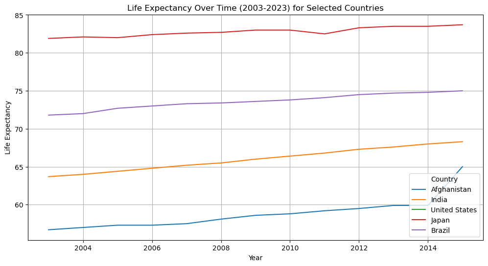
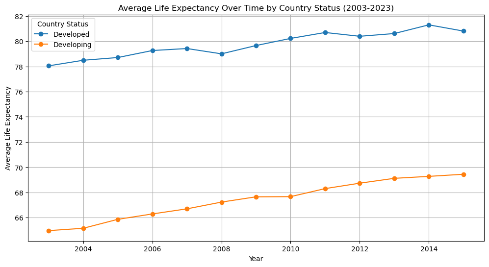

# life-expectancy-multisource-analysis
Multi-source life expectancy analysis (2003-2023) combining a Kaggle dataset, Wikipedia scrape, and WHO API data

# Life Expectancy Multi-Source Analysis (2003–2023)

This project explores the relationship between life expectancy, mortality rates, and immunization rates across countries from 2003 to 2023, combining data from three different source types: a flat file, a scraped website, and a public API.

## Data Sources

- **Kaggle dataset (flat file)** — life expectancy and related health, economic, and social factors for 193 countries, 2003–2015. Originally collected from WHO and the United Nations.
- **Wikipedia (web scrape)** — life expectancy figures by country and gender, including the most recent World Bank figures for 2022.
- **WHO Global Health Observatory API** — life expectancy and health indicators by country, covering 2016–2023.

Together, these three sources cover the full 2003–2023 period: the Kaggle data anchors 2003–2015, Wikipedia fills the gap around 2022, and the WHO API covers 2016–2023. All three are joined on country name.

## Notebooks

**`01_cleaning_flatfile.ipynb`** — Cleans the Kaggle CSV: identifies and handles missing values by country, drops columns with excessive missingness, removes duplicates, fixes column names, imputes missing values (mean or median depending on skew), and caps outliers at the 99th percentile.

**`02_cleaning_webscrape.ipynb`** — Scrapes life expectancy tables from Wikipedia, flattens multi-level column headers, standardizes column names across tables, converts fields to numeric types, and fills missing values with the median.

**`03_api_extraction.ipynb`** — Pulls life expectancy data from the WHO Global Health Observatory API, converts the JSON response to a DataFrame, removes duplicates, filters to 2003–2023, renames columns for clarity, and flags outliers using Z-scores.

**`04_merge_and_visualize.ipynb`** — Loads all three cleaned datasets into a SQLite database, joins them on country (and year, where applicable), removes duplicate country-year rows, and produces five visualizations exploring life expectancy trends and correlations.

## Key Visualizations & Insights

1. **Life expectancy over time (2003–2023)** for Afghanistan, India, United States, Japan, and Brazil — highlights the persistent gap between developed and developing countries.

 
2. **Life expectancy vs. immunization rates** (Polio and Diphtheria) — higher immunization rates generally correlate with higher life expectancy.
3. **Life expectancy vs. schooling** — a clear positive correlation between average years of schooling and life expectancy.
4. **Average life expectancy by country status** (developed vs. developing) — a consistent, significant gap favoring developed countries across the full period.

5. **Life expectancy vs. alcohol consumption** — results were inconclusive, with minimal difference in life expectancy across consumption levels.

## Tech Stack

Python · pandas · matplotlib · SQLite · requests · scipy · web scraping (`pd.read_html`)

## A Note on Data Ethics

All data used in this project came from openly accessible, credible sources (Kaggle, Wikipedia, WHO). Care was taken when interpreting results, since comparing life expectancy across countries with very different levels of wealth, healthcare access, and social conditions risks oversimplifying the many factors involved.
